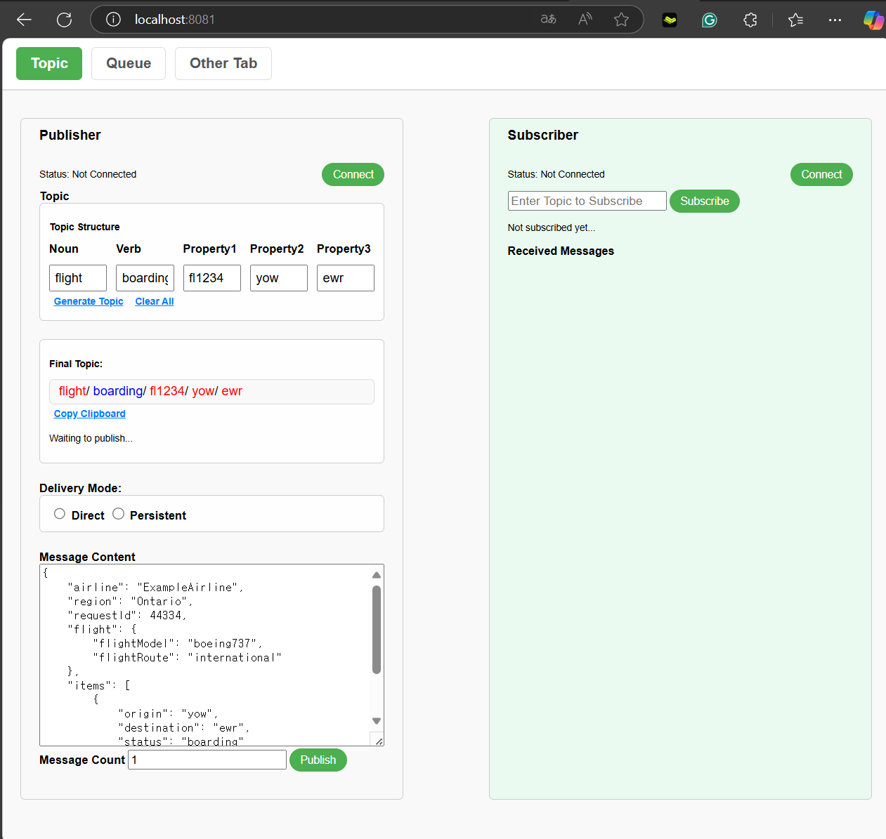

# Solace JCSMP API Test

이 프로젝트는 Solace JCSMP 메시징 API를 테스트하고 학습하기 위해 제작되었습니다.

## **설치 및 실행 방법**
1. **Java 17 설치**: [Java 설치 안내 링크](https://www.oracle.com/java/technologies/javase-downloads.html)
2. **소스코드 가져오기**:
   ```bash
   git clone git@github.com:okaypark/Solace_JCSMP_API_Test.git
   cd Solace_JCSMP_API_Test
   ```
3. **빌드 및 실행**:
   ```bash
   ./gradlew clean build
   java -jar build/libs/PublisherService-1.0.0.jar
   ```
   웹페이지 실행 URL : http://localhost:8081



4. 클래스 다이아그램
     


5. 시퀀스 다이아그램
   


## **추가작업 예정**
- Queue topic 처리
- 게런티드(persistent), direct 구분 기능
- Reolay 기능 추가

- PLAYGROUND js 분석 및 JCSMP API 프로그램과 연동 구상


## **주요 기능**
- Solace 메시지 브로커 동작 확인.
- 특정 메시징 시나리오 구현.
- Spring Boot와 Jakarta EE와의 통합 학습.
- JCSMP PUB/SUB TOPIC 메세지 처리

## **기술 스택**
- **Java 17**
- Spring Boot
- Docker (Optional)
- Solace JCSMP API

---

## **기타 정보**
- 이 프로젝트는 개인 학습 목적으로 제작되었으며, 상업적으로 사용되지 않습니다.